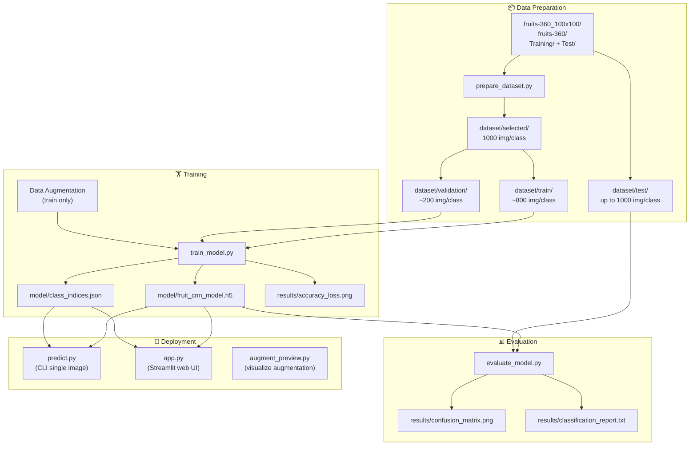
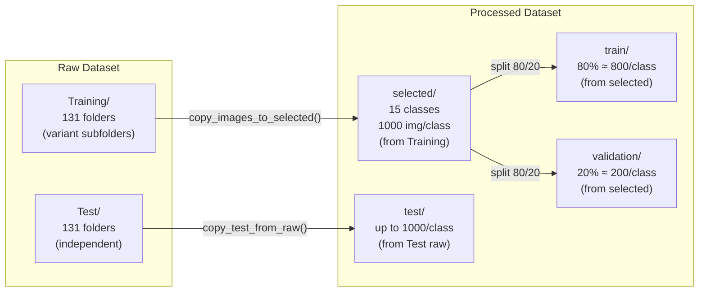

# 🍎 Fruit Classification Project — Complete Documentation

> **Fruit Augmentation — CNN Transfer Learning with MobileNetV2**
> 
> A 15-class fruit image classifier using Transfer Learning (MobileNetV2 pre-trained on ImageNet), with data augmentation, two-phase training, and a Streamlit web UI.

---

## 📋 Table of Contents

1. [Project Overview](#1-project-overview)
2. [System Architecture](#2-system-architecture)
3. [File-by-File Breakdown](#3-file-by-file-breakdown)
4. [Data Pipeline](#4-data-pipeline)
5. [Model Architecture](#5-model-architecture)
6. [Training Strategy](#6-training-strategy)
7. [Evaluation Results](#7-evaluation-results)
8. [Overfitting Analysis](#8-overfitting-analysis)
9. [How to Run](#9-how-to-run)
10. [Dependencies](#10-dependencies)

---

## 1. Project Overview

| Property | Value |
|----------|-------|
| **Task** | Multi-class image classification (15 fruits) |
| **Dataset** | Fruits-360 (100×100 version) |
| **Base Model** | MobileNetV2 (pre-trained on ImageNet) |
| **Input Size** | 224 × 224 × 3 (RGB) |
| **Classes** | 15 fruit types |
| **Framework** | TensorFlow / Keras |
| **UI** | Streamlit |
| **Final Test Accuracy** | **98.82%** |
| **Macro F1-score** | **0.9907** |

### 15 Classes

| # | Class | # | Class | # | Class |
|---|-------|---|-------|---|-------|
| 0 | Apple 🍎 | 5 | Watermelon 🍉 | 10 | Grape 🍇 |
| 1 | Banana 🍌 | 6 | Pineapple 🍍 | 11 | Peach 🍑 |
| 2 | Orange 🍊 | 7 | Kiwi 🥝 | 12 | Pear 🍐 |
| 3 | Mango 🥭 | 8 | Lemon 🍋 | 13 | Blueberry 🫐 |
| 4 | Strawberry 🍓 | 9 | Cherry 🍒 | 14 | Avocado 🥑 |

---

## 2. System Architecture



---

## 3. File-by-File Breakdown

### 3.1 `config.py` — Central Configuration

All hyperparameters, paths, and settings in one place:

| Parameter | Value | Description |
|-----------|-------|-------------|
| `IMG_SIZE` | 224 | Input image dimensions (MobileNetV2 standard) |
| `BATCH_SIZE` | 16 | Images per gradient update |
| `EPOCHS` | 20 | Phase 1 epochs (classification head) |
| `FINE_TUNE_EPOCHS` | 10 | Phase 2 epochs (fine-tune base) |
| `NUM_CLASSES` | 15 | Output classes |
| `MAX_IMAGES_PER_CLASS` | 1000 | Max images per class from raw dataset |
| `PHASE1_LR` | 0.001 | Learning rate for Phase 1 |
| `PHASE2_LR` | 0.00003 | Learning rate for Phase 2 (very low) |
| `FINE_TUNE_RATIO` | 0.35 | Unfreeze bottom 35% of MobileNetV2 layers |
| `TRAIN_RATIO` | 0.8 | 80% train / 20% validation split |
| `LOW_CONFIDENCE_THRESHOLD` | 0.70 | Warning threshold for predictions |

**Augmentation Config:**
| Parameter | Value |
|-----------|-------|
| `rotation_range` | 30° |
| `zoom_range` | 0.3 (70%–130%) |
| `width_shift_range` | 0.15 (15%) |
| `height_shift_range` | 0.15 (15%) |
| `horizontal_flip` | True |
| `brightness_range` | [0.7, 1.3] |
| `shear_range` | 10° |
| `fill_mode` | nearest |

**Source Folder Mapping:** Each class maps to multiple variant folders in Fruits-360 (e.g., "Apple" → 31 folders like "Apple 5", "Apple Red 1", "Apple Golden 2", etc.)

### 3.2 `prepare_dataset.py` — Dataset Preparation

**Workflow:**

1. `check_raw_dataset()` — Verifies `fruits-360/Training/` and `fruits-360/Test/` exist
2. `clean_directories()` — Clears old `dataset/selected/`, `dataset/train/`, `dataset/validation/`, `dataset/test/`
3. `copy_images_to_selected()` — From **Training** → `dataset/selected/`:
   - Reads images from all variant folders per class
   - Shuffles within each folder (seed=42)
   - Distributes quota evenly across variant folders
   - Max 1000 images per class
4. `split_train_validation()` — `selected/` → 80% `train/` + 20% `validation/`
5. `copy_test_from_raw()` — From **Test** (separate!) → `dataset/test/` (up to 1000/class)

> ⚠️ **Critical:** Test images come from the original Fruits-360 `Test/` folder, **completely separate** from Training. This prevents data leakage.

### 3.3 `train_model.py` — Model Training

**Two-Phase Training Pipeline:**

#### Phase 1: Train Classification Head
```
MobileNetV2 (FROZEN) → GAP → Dense(128, ReLU) → Dropout(0.4) → Dense(15, Softmax)
```
- Base model fully frozen (acts as fixed feature extractor)
- Only ~130K new parameters trained
- LR = 0.001 (Adam)
- Callbacks: EarlyStopping (patience=5), ReduceLROnPlateau (factor=0.5, patience=3), ModelCheckpoint

#### Phase 2: Fine-tune Base Model
- Unfreeze bottom 35% of MobileNetV2 layers
- LR = 0.00003 (30× lower than Phase 1)
- Callbacks: EarlyStopping (patience=5), ModelCheckpoint

**Outputs:**
- `model/fruit_cnn_model.h5` — Trained Keras model
- `model/class_indices.json` — `{0: "Apple", 1: "Avocado", ...}`
- `results/accuracy_loss.png` — Training curves

### 3.4 `evaluate_model.py` — Model Evaluation

Evaluates on the **separate test set** (from original Fruits-360 Test folder):

1. Loads model and test data via generator (batch streaming, not RAM-loaded)
2. Forces class order to match `class_indices.json`
3. Computes:
   - Accuracy
   - Confusion Matrix → `results/confusion_matrix.png`
   - Precision, Recall, F1-score (per-class + macro)
   - Classification Report → `results/classification_report.txt`

### 3.5 `predict.py` — Single Image Prediction (CLI)

Command-line tool to predict a single fruit image:
1. Loads model + class indices
2. Preprocesses image: resize → RGB → MobileNetV2 normalize
3. Predicts top-5 classes with confidence scores
4. Warns if confidence < 70%

### 3.6 `app.py` — Streamlit Web Application

Interactive web UI with 4 tabs:
- **Phân loại ảnh** — Upload & classify fruit images
- **Tăng cường dữ liệu** — Preview data augmentation effects
- **Kết quả mô hình** — Display evaluation metrics
- **Thông tin hệ thống** — System info

Features: Custom CSS (light theme), confidence badges (green/yellow/red), stat cards, responsive layout.

### 3.7 `augment_preview.py` — Augmentation Visualization

Generates a comparison image showing:
- 1 original image (from `dataset/train/Apple/`)
- 5 augmented variants (rotation, zoom, shift, flip, brightness)

Output: `results/augmentation_preview.png`

---

## 4. Data Pipeline



### Actual Test Set Distribution

| Class | Test Images | Class | Test Images | Class | Test Images |
|-------|------------|-------|------------|-------|------------|
| Apple | 1,000 | Watermelon | 157 | Grape | 1,000 |
| Avocado | 1,000 | Pineapple | 329 | Peach | 1,000 |
| Banana | 645 | Kiwi | 156 | Pear | 1,000 |
| Mango | 308 | Lemon | 330 | Blueberry | 154 |
| Orange | 1,000 | Cherry | 1,000 | Strawberry | 725 |

> **Total test images: 9,804** (some classes have fewer because the raw Test folder has fewer images)

---

## 5. Model Architecture

```
Layer (type)                    Output Shape          Param #
=================================================================
input (InputLayer)              (None, 224, 224, 3)   0
mobilenetv2 (Functional)        (None, 7, 7, 1280)    2,257,984  ← Frozen initially
gap (GlobalAveragePooling2D)    (None, 1280)          0
dense_head (Dense)              (None, 128)           163,968    ← New (ReLU)
dropout_head (Dropout)          (None, 128)           0          ← 40% dropout
output (Dense)                  (None, 15)            1,935      ← New (Softmax)
=================================================================
Total params: 2,423,887
Trainable (Phase 1): ~166K    (only head)
Trainable (Phase 2): ~956K    (head + 35% of MobileNetV2)
=================================================================
```

### Why MobileNetV2?

| Advantage | Detail |
|-----------|--------|
| **Pre-trained on ImageNet** | 1.4M images, 1000 classes — already knows edges, textures, shapes |
| **Lightweight** | Only ~2.4M total params (vs ResNet50's ~25M) |
| **Depthwise separable convolutions** | Efficient, runs well on CPU |
| **Inverted residuals + linear bottlenecks** | Good feature preservation |

### Loss Function: Categorical Crossentropy

$$L = -\sum_{i=1}^{15} y_i \cdot \log(\hat{y}_i)$$

Where $y_i$ is the one-hot ground truth and $\hat{y}_i$ is the predicted probability.

### Optimizer: Adam

- Phase 1: `lr=0.001` (fast learning for new head)
- Phase 2: `lr=0.00003` (tiny steps to avoid catastrophic forgetting)

---

## 6. Training Strategy

### Callbacks

| Callback | Phase | Effect |
|----------|-------|--------|
| `EarlyStopping(patience=5, restore_best_weights=True)` | 1 & 2 | Stops if val_loss doesn't improve for 5 epochs, reverts to best |
| `ReduceLROnPlateau(factor=0.5, patience=3)` | 1 only | Halves LR if val_loss plateaus for 3 epochs |
| `ModelCheckpoint(save_best_only=True)` | 1 & 2 | Saves model only when val_accuracy improves |

### Why Two-Phase Training?

| Phase | What's Trained | LR | Why |
|-------|---------------|-----|-----|
| **Phase 1** | Only the new classification head | 0.001 | Head weights are random — need to learn fast from scratch |
| **Phase 2** | Head + bottom 35% of MobileNetV2 | 0.00003 | Fine-tune pre-trained features to fruit domain — tiny steps to preserve ImageNet knowledge |

### Regularization Techniques

1. **Dropout(0.4)** — Randomly drops 40% of neurons in the dense head during training
2. **Data Augmentation** — Each training image is randomly transformed every epoch
3. **Early Stopping** — Prevents overfitting by stopping before validation loss degrades
4. **Low Learning Rate in Phase 2** — Prevents catastrophic forgetting of pre-trained features
5. **Transfer Learning** — Starting from ImageNet weights provides strong generalization

---

## 7. Evaluation Results

### Overall Metrics

| Metric | Value |
|--------|-------|
| **Accuracy** | **98.82%** |
| **Macro Precision** | 0.9895 |
| **Macro Recall** | 0.9921 |
| **Macro F1-score** | 0.9907 |

### Per-Class Performance

| Class | Precision | Recall | F1-score | Support |
|-------|-----------|--------|----------|---------|
| Apple 🍎 | 0.9851 | 0.9270 | **0.9552** ⚠️ | 1,000 |
| Avocado 🥑 | 1.0000 | 0.9940 | 0.9970 | 1,000 |
| Banana 🍌 | 1.0000 | 0.9922 | 0.9961 | 645 |
| Blueberry 🫐 | 0.9747 | 1.0000 | 0.9872 | 154 |
| Cherry 🍒 | 0.9881 | 1.0000 | 0.9940 | 1,000 |
| Grape 🍇 | 1.0000 | 1.0000 | **1.0000** 🏆 | 1,000 |
| Kiwi 🥝 | 1.0000 | 1.0000 | **1.0000** 🏆 | 156 |
| Lemon 🍋 | 0.9851 | 1.0000 | 0.9925 | 330 |
| Mango 🥭 | 0.9904 | 1.0000 | 0.9952 | 308 |
| Orange 🍊 | 0.9970 | 1.0000 | 0.9985 | 1,000 |
| Peach 🍑 | 0.9520 | 0.9910 | **0.9711** ⚠️ | 1,000 |
| Pear 🍐 | 0.9760 | 0.9770 | 0.9765 | 1,000 |
| Pineapple 🍍 | 1.0000 | 1.0000 | **1.0000** 🏆 | 329 |
| Strawberry 🍓 | 1.0000 | 1.0000 | **1.0000** 🏆 | 725 |
| Watermelon 🍉 | 0.9937 | 1.0000 | 0.9968 | 157 |

### Best & Weakest Classes

| Rank | Best (F1=1.0) | Weakest |
|------|--------------|---------|
| 🏆 | Grape, Kiwi, Pineapple, Strawberry | |
| ⚠️ | | Apple (F1=0.9552), Peach (F1=0.9711) |

### Confusion Patterns

- **Apple (recall=0.9270):** ~7.3% of real Apple images are misclassified as something else (likely Peach or Pear — similar round shape)
- **Peach (precision=0.9520):** ~4.8% of "Peach" predictions are actually other fruits (likely Apple or Pear)
- **Pear** has both precision and recall at ~0.977 — some confusion with Apple/Peach (all round, similar-colored fruits)

---

## 8. Overfitting Analysis

### ❓ Is 98.82% test accuracy a sign of overfitting?

**Short answer: Probably NOT overfitting.** Here's the detailed analysis:

### ✅ Evidence AGAINST Overfitting

| Factor | Explanation |
|--------|-------------|
| **Separate test set** | Test images come from the **original Fruits-360 Test folder**, completely independent from Training. No data leakage. |
| **Fruits-360 is an "easy" dataset** | All images have clean white backgrounds, consistent lighting, centered objects. The model learns shape+texture, not background noise. 98%+ accuracy is **common** on this dataset. |
| **Transfer Learning from ImageNet** | MobileNetV2 was pre-trained on 1.4M diverse images. Its features are highly generalizable — it doesn't easily overfit to 15 fruit classes. |
| **Multiple regularization layers** | Dropout(0.4), Data Augmentation (8 techniques), EarlyStopping, low Phase 2 LR — all designed specifically to prevent overfitting. |
| **Consistent per-class metrics** | All 15 classes have F1 ≥ 0.955. Overfitting typically causes **uneven** performance (some classes near 100%, others poor). |
| **Weak classes make sense** | Apple/Peach/Pear confusion is **semantically reasonable** — they're all round fruits with similar colors. A truly overfit model would show random confusion patterns. |

### ⚠️ Signs That Need Monitoring (Not Proof of Overfitting)

| Sign | Why It's Not Necessarily Overfitting |
|------|--------------------------------------|
| 98.82% seems "too high" | Fruits-360 papers report 95-99% accuracy routinely. The dataset is intentionally clean for benchmarking. |
| Some classes at 100% | Grape, Kiwi, Pineapple, Strawberry have **very distinctive visual features** (texture, shape, color). 100% F1 on these is expected. |
| Imbalanced test set | Blueberry (154), Kiwi (156), Watermelon (157) have small test sets — but their performance is consistent with larger classes. |

### 🔍 How to DEFINITIVELY Check for Overfitting

To be 100% certain, compare these numbers (from `results/accuracy_loss.png`):

| What to Compare | Overfitting Sign | Healthy Sign |
|----------------|------------------|--------------|
| **Train accuracy vs Validation accuracy** | Train >> Val (gap > 5%) | Train ≈ Val (gap < 3%) |
| **Train loss vs Validation loss** | Val loss increases while train loss decreases | Both decrease together |
| **Phase 1 vs Phase 2 validation accuracy** | Phase 2 << Phase 1 | Phase 2 ≥ Phase 1 |

> 📊 **Check your `results/accuracy_loss.png` file!** If validation accuracy closely tracks training accuracy (within 2-3%), the model is NOT overfitting.

### 🎯 Verdict

Based on the available evidence:
- The **data split is correct** (test = independent from train)
- The **regularization is comprehensive**
- The **confusion patterns are semantically meaningful**
- Fruits-360 is known to achieve 95-99% accuracy

**→ This is most likely a well-generalized model, not an overfit one.**

The only remaining check: verify that training accuracy isn't dramatically higher than validation accuracy (should be within ~3%).

---

## 9. How to Run

### Step 1: Install Dependencies
```bash
pip install -r requirements.txt
```

### Step 2: Prepare Dataset
```bash
python prepare_dataset.py
```
> Requires `fruits-360_100x100/fruits-360/` with `Training/` and `Test/` subdirectories.

### Step 3: Train Model
```bash
python train_model.py
```
> Outputs: `model/fruit_cnn_model.h5`, `model/class_indices.json`, `results/accuracy_loss.png`

### Step 4: Evaluate Model
```bash
python evaluate_model.py
```
> Outputs: `results/confusion_matrix.png`, `results/classification_report.txt`

### Step 5: Predict Single Image
```bash
python predict.py
```
> Place image as `sample_images/test_image.jpg`

### Step 6: Launch Web App
```bash
streamlit run app.py
```

---

## 10. Dependencies

```
tensorflow>=2.12.0
streamlit>=1.25.0
numpy>=1.24.0
matplotlib>=3.7.0
seaborn>=0.12.0
scikit-learn>=1.3.0
Pillow>=9.5.0
```

---

## 📁 Project File Structure

```
fruit-augmentation/
├── config.py                  # Central configuration
├── prepare_dataset.py         # Dataset preparation pipeline
├── train_model.py             # Two-phase training with MobileNetV2
├── evaluate_model.py          # Test set evaluation
├── predict.py                 # CLI single-image prediction
├── app.py                     # Streamlit web application
├── augment_preview.py         # Augmentation visualization
├── requirements.txt           # Python dependencies
├── README.md                  # Vietnamese overview
├── GIAI_THICH_CHI_TIET_MO_HINH.md  # Detailed Vietnamese explanation
├── PROJECT_DOCUMENTATION.md   # ← THIS FILE (English comprehensive docs)
│
├── fruits-360_100x100/        # Raw dataset (not in repo)
│   └── fruits-360/
│       ├── Training/          # 131 variant subfolders
│       └── Test/              # 131 variant subfolders (independent)
│
├── dataset/                   # Processed dataset (generated)
│   ├── selected/              # 15 classes, 1000 img/class (from Training)
│   ├── train/                 # 80% of selected (~800/class)
│   ├── validation/            # 20% of selected (~200/class)
│   └── test/                  # From raw Test/ (independent!)
│
├── model/                     # Trained model (generated)
│   ├── fruit_cnn_model.h5     # Keras H5 model
│   └── class_indices.json     # Index → class name mapping
│
├── results/                   # Evaluation outputs (generated)
│   ├── classification_report.txt
│   ├── confusion_matrix.png
│   ├── accuracy_loss.png
│   └── augmentation_preview.png
│
└── sample_images/             # Images for predict.py (user-provided)
    └── test_image.jpg
```

---

*Documentation generated on 2026-06-14 · Model: MobileNetV2 Transfer Learning · Accuracy: 98.82%*
